<div align="center">

  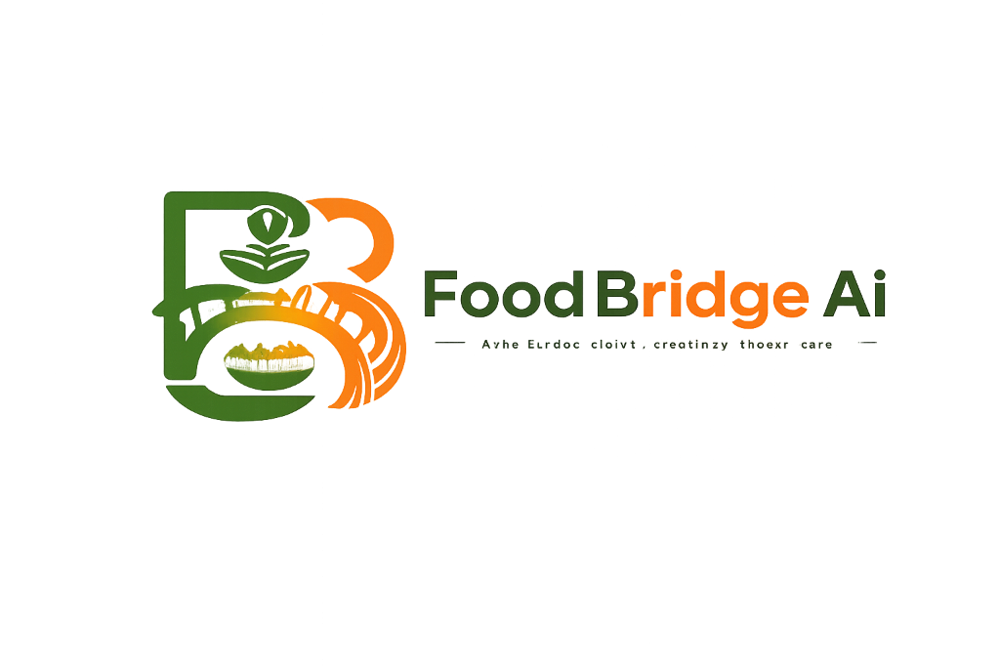

  # FoodBridge AI

  **Empowering Communities to Eliminate Food Waste Through Intelligent Real-Time Logistics**

  [](LICENSE)
  [](https://nodejs.org/)
  [](https://react.dev/)
  [](https://www.typescriptlang.org/)
  []()
  []()
  []()
  []()
  []()

</div>

---

## 📋 Table of Contents

- [📌 Project Overview](#-project-overview)
  - [Problem Statement](#problem-statement)
  - [The FoodBridge AI Solution](#the-foodbridge-ai-solution)
  - [Core Objectives](#core-objectives)
- [📊 Project Statistics](#-project-statistics)
- [✨ Key Features](#-key-features)
- [🖼️ Application Screenshots](#️-application-screenshots)
- [🛠️ Technology Stack](#️-technology-stack)
- [🏗️ System Architecture](#️-system-architecture)
- [📂 Folder Structure](#-folder-structure)
- [⚡ Quick Start & Installation](#-quick-start--installation)
  - [Prerequisites](#prerequisites)
  - [1. Clone Repository](#1-clone-repository)
  - [2. Backend Setup](#2-backend-setup)
  - [3. Frontend Setup](#3-frontend-setup)
  - [4. Running Docker Environment](#4-running-docker-environment)
- [🔑 Environment Variables](#-environment-variables)
  - [Backend Configuration (`backend/.env`)](#backend-configuration-backendenv)
  - [Frontend Configuration (`frontend/.env`)](#frontend-configuration-frontendenv)
- [📡 API Architecture & Endpoints](#-api-architecture--endpoints)
- [🔐 Authentication & Authorization Flow](#-authentication--authorization-flow)
- [👥 User Roles & Permissions](#-user-roles--permissions)
- [🔄 Major System Workflows](#-major-system-workflows)
  - [1. Food Donation Workflow](#1-food-donation-workflow)
  - [2. Claim & Reservation Workflow](#2-claim--reservation-workflow)
  - [3. Notification Dispatch Workflow](#3-notification-dispatch-workflow)
- [🧪 Testing Architecture](#-testing-architecture)
- [🛡️ Security Protocols](#-security-protocols)
- [⚡ Performance Optimizations](#-performance-optimizations)
- [🤝 Contributing](#-contributing)
- [📄 License](#-license)
- [👤 Author & Acknowledgments](#-author--acknowledgments)

---

## 📌 Project Overview

### Problem Statement
Globally, over **1.3 billion tons of edible food is wasted annually**, while millions suffer from food insecurity. Restaurants, supermarkets, event venues, and households frequently discard surplus food due to a lack of immediate, localized distribution channels. Traditional donation channels suffer from **logistical latency**, **poor visibility**, and manual claim overhead, causing perishable food to spoil before reaching those in need.

### The FoodBridge AI Solution
**FoodBridge AI** is a full-stack food surplus donation and retrieval platform that bridges the gap between surplus food generators (donors) and community organizations (NGOs, shelters, receivers, and volunteers) in real time.

By integrating **interactive geospatial mapping (React Leaflet)**, **event-driven web sockets (Socket.IO)**, **asynchronous background queues (BullMQ + Redis)**, and **role-aware portals**, FoodBridge AI enables donors to list surplus meals within seconds and receivers to locate and claim nearby food before expiration.

### Core Objectives
1. **Zero Spoilage Logistics**: Automate real-time notification broadcasts and expiry countdown timers for surplus food.
2. **Geospatial Precision**: Map food donation listings with dynamic distance filtering and custom map markers.
3. **Role Enforcement**: Provide tailored dashboards for Donors, Receivers/NGOs, Volunteers, and System Administrators.
4. **Resilient Architecture**: Maintain zero downtime through Redis-backed rate limiting, BullMQ background workers, and persistent JWT session rotation.

---

## 📊 Project Statistics

| Metric | Total Count | Details |
| :--- | :--- | :--- |
| **Frontend UI Components** | **113 Components** | React 19 atomic components, pages, modals & feature views |
| **Backend Code Modules** | **80 Modules** | Express controllers, services, repositories, schemas & workers |
| **REST API Endpoints** | **45 Endpoints** | Auth, Users, Food, Reservations, Notifications, Admin |
| **Real-Time Socket Events** | **11 Events** | Dynamic WebSocket lifecycle events & targeted room broadcasts |
| **Database Schemas** | **4 Mongoose Models** | GeoJSON spatial indexing (`User`, `Food`, `Reservation`, `Notification`) |
| **Background Queue Workers**| **4 BullMQ Workers** | Asynchronous email, food expiry, reservation expiry & broadcast workers |
| **Test Suites** | **32 Suites** | 11 Jest Unit + 7 Jest Integration + 14 Playwright E2E Specs |
| **Total Automated Tests** | **247 Executions** | **100% Pass Rate** (148 Unit + 48 Integration + 51 E2E Runs) |

---

## ✨ Key Features

### 🔐 Authentication & Session Security
- **Secure Credentials**: Multi-factor account validation, bcrypt password hashing (12 rounds), and timed OTP account verification.
- **JWT Token Rotation**: Dual-token architecture with 15-minute access tokens and 30-day Redis-backed refresh token rotation.
- **Session Protection**: Automatic HTTP 401 interceptor refresh queue on the frontend to ensure uninterrupted user sessions.

### 🍱 Food Donation Management
- **Listing Creation**: Donors publish food offerings with title, description, quantity, dietary tags (veg, vegan, halal, gluten-free), pickup window, and expiry time.
- **Geospatial Tagging**: Automatic reverse-geocoding of pickup locations into GeoJSON coordinates (`latitude`, `longitude`).
- **State Machine Rules**: Automated status transitions (`AVAILABLE` → `CLAIMED` → `PICKED_UP` → `COMPLETED` / `EXPIRED`).

### 🤝 Claim & Reservation Logistics
- **Claim Workflow**: NGOs and volunteers reserve available food with a single click.
- **Anti-Double-Claiming**: Redis lock prevention ensuring a listing cannot be claimed simultaneously by multiple receivers.
- **Lifecycle Moderation**: Donors accept, reject, mark picked up, or mark complete with instant notification updates to the claimer.

### 🔔 Real-Time Notification Engine
- **Socket.IO Integration**: Instant real-time push alerts for donation updates, claim acceptances, and cancellation events.
- **Persistent Feed**: In-app notification drawer with unread badges, mark-as-read toggles, and item deletion.
- **Admin Broadcasts**: Bulk broadcast engine allowing administrators to notify targeted user roles or system-wide users.

### 🗺️ Interactive Maps & Proximity Search
- **React Leaflet Map**: Dynamic interactive map displaying nearby active food donations.
- **Current Geolocation**: Browser GPS integration with single-click "Locate Me" position centering.
- **Custom Popup Cards**: Interactive popup modals showing food details, distance, quantity, and direct claim triggers.

### 👑 Admin Management Portal
- **Dashboard Metrics**: Real-time aggregate statistics on total users, active listings, fulfilled claims, and total meals saved.
- **User Moderation**: Paginated user management table with account suspension, activation, and role modification controls.
- **System Moderation**: System-wide inspection queues for all active food listings and reservation lifecycles.
- **Analytics Charts**: Interactive time-series visual charts built with Recharts displaying user growth and donation fulfillment trends.

---

## 🖼️ Application Screenshots

<div align="center">

### 1. Home Page
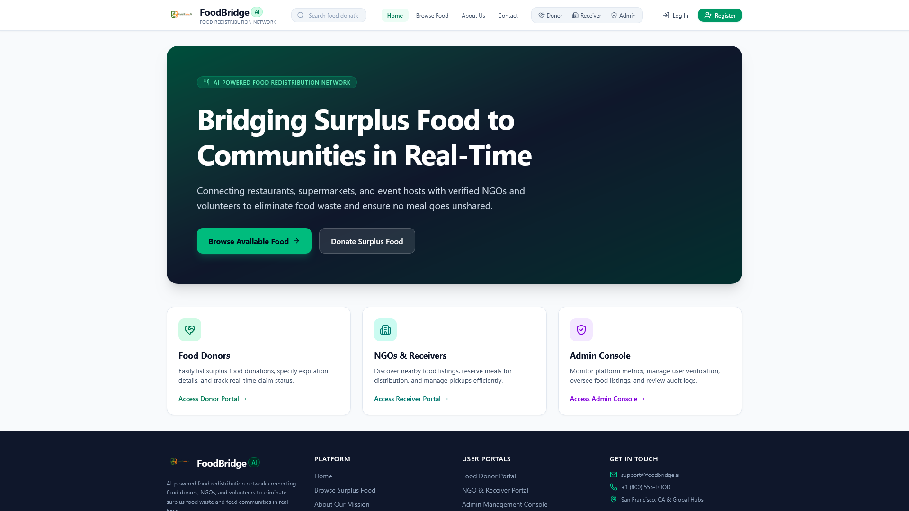

### 2. Login Page
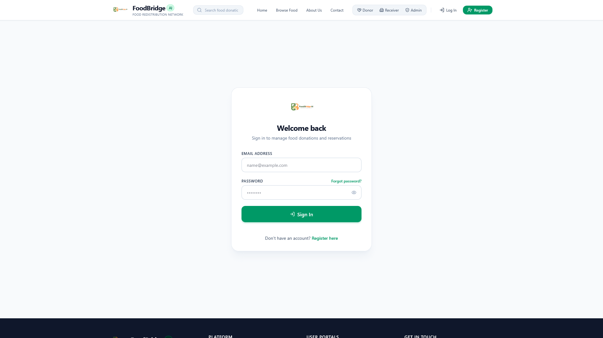

### 3. Register Page
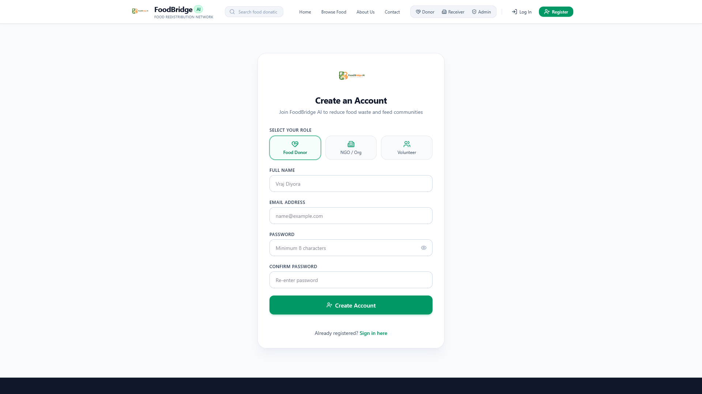

### 4. Donor Dashboard


### 5. Create Food Donation
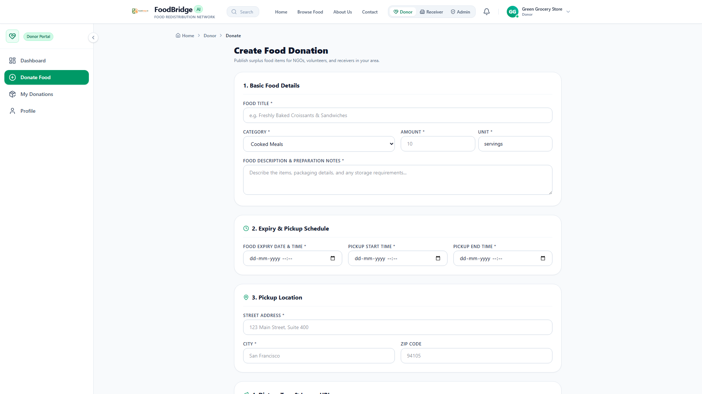

### 6. My Donations Management
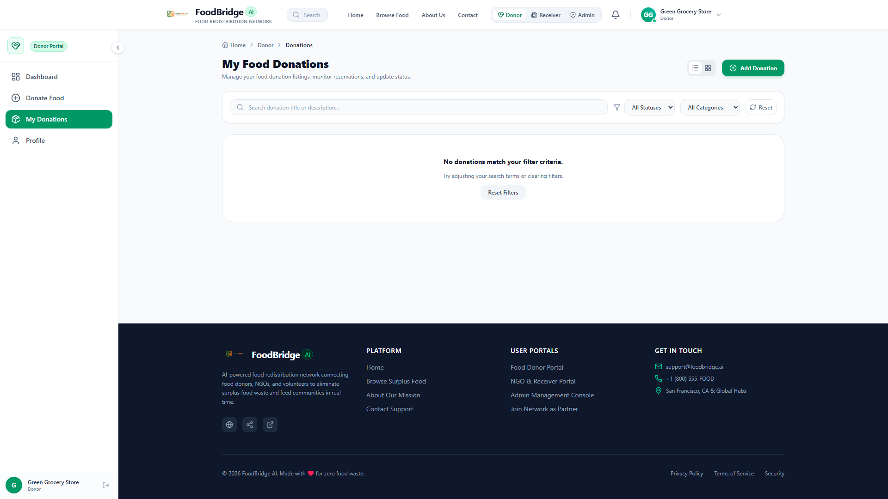

### 7. Browse Food Catalog
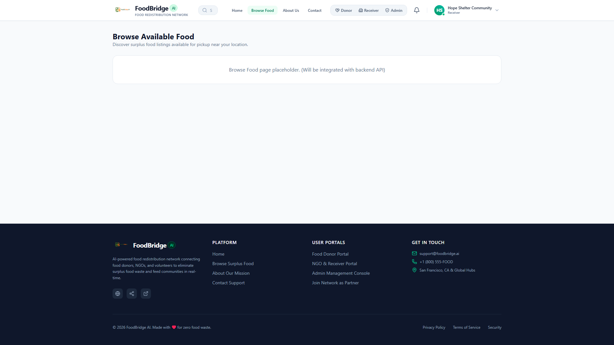

### 8. Available Food Details
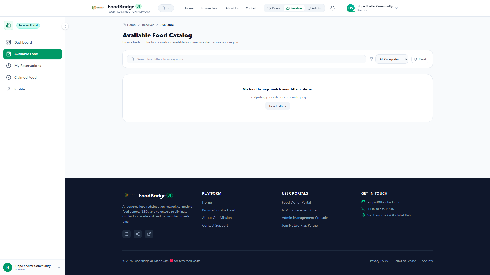

### 9. Receiver Dashboard
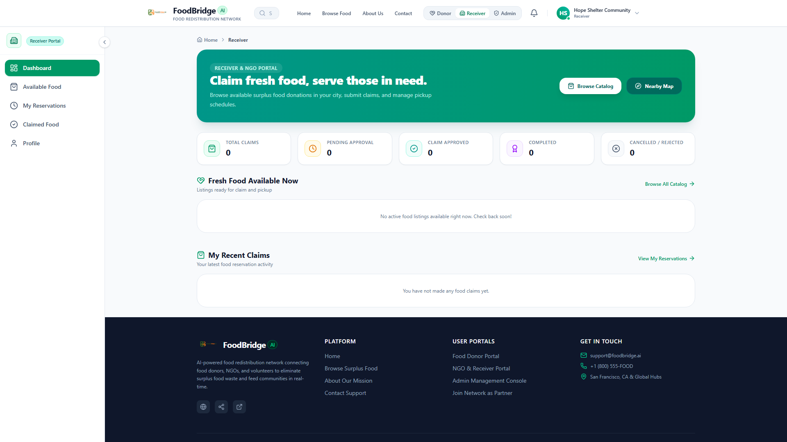

### 10. My Reservations
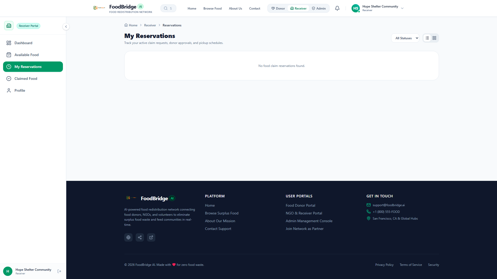

### 11. Notification Drawer (Real-Time Feed)
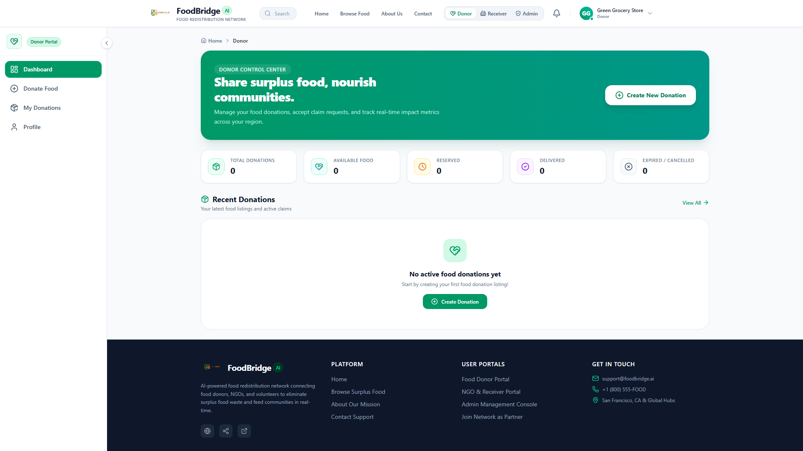

### 12. User Profile & Settings
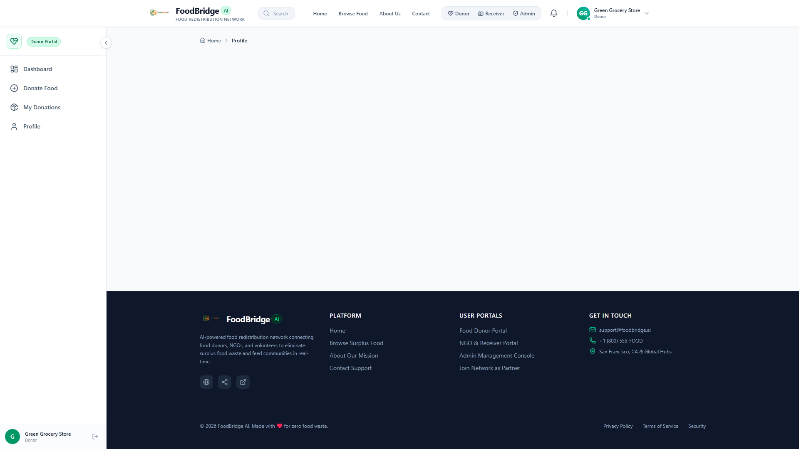

### 13. Interactive Geolocation Map
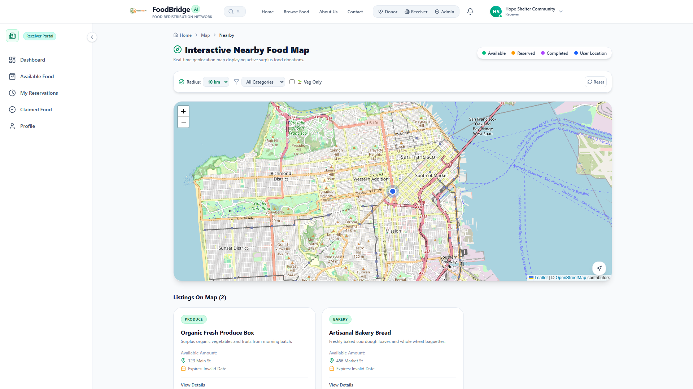

### 14. Admin Console Dashboard
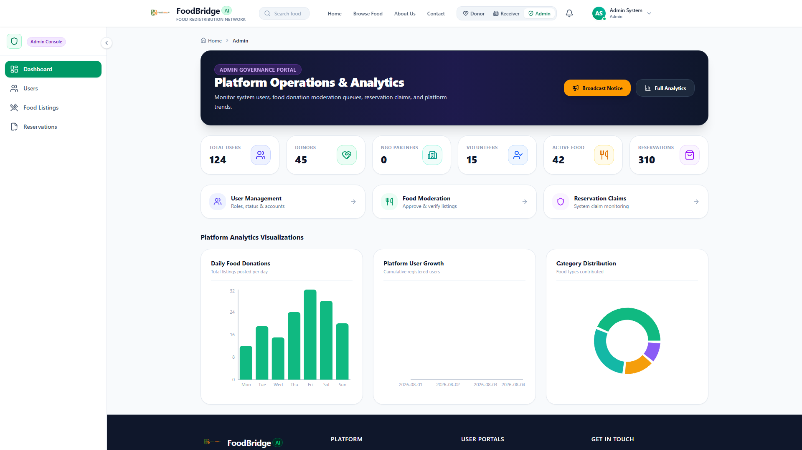

### 15. Admin User Management & Controls
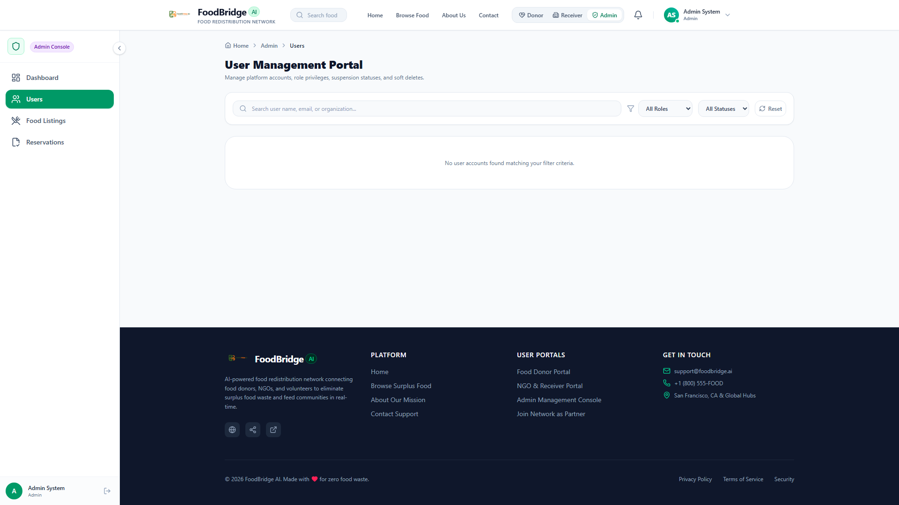

### 16. Recharts System Analytics


</div>

---

## 🛠️ Technology Stack

| Domain | Technology / Library | Version | Description |
| :--- | :--- | :--- | :--- |
| **Frontend Core** | React | `v19.2.7` | Component-driven UI architecture |
| **Build Tool** | Vite | `v8.1.1` | Fast frontend build tooling |
| **Language** | TypeScript | `v5.7.3` | Strict static typing across frontend & backend |
| **Styling** | Tailwind CSS | `v4.3.3` | Utility-first responsive design |
| **State & Data** | TanStack React Query | `v5.66.0` | Server state management and caching |
| **Forms & Validation** | React Hook Form + Zod | `v7.83.0` / `v3.24.2` | Schema-driven form handling |
| **Interactive Maps** | React Leaflet + Leaflet | `v5.0.0` / `v1.9.4` | Open-source map visualizer |
| **Data Visualization**| Recharts | `v2.15.1` | Analytics charts and metrics rendering |
| **Backend Runtime** | Node.js + Express | `v20.x` / `v4.21.2` | Application server framework |
| **Database** | MongoDB + Mongoose | `v8.9.5` | Document store with GeoJSON 2dsphere spatial indexing |
| **Caching & Queues** | Redis (ioredis) + BullMQ | `v5.6.0` / `v5.41.7` | Caching, session storage & background job queues |
| **Real-Time Engine** | Socket.IO | `v4.8.3` | Bi-directional WebSocket communication |
| **Email Delivery** | Nodemailer | `v6.10.0` | Transactional SMTP email notification service |
| **Documentation** | Swagger / OpenAPI | `v5.5.0` | Interactive API documentation (`/api-docs`) |
| **Unit Testing** | Jest | `v29.7.0` | Backend unit test suite (148 tests) |
| **Integration Testing**| Supertest + MongoMemoryServer| `v7.0.0` / `v10.1.3`| In-memory integration test suite (48 tests) |
| **E2E Testing** | Playwright + Axe Core | `v1.50.0` / `v4.10.1`| Cross-browser POM & accessibility E2E suite (38 runs) |

---

## 🏗️ System Architecture

FoodBridge AI adheres to a strict **Layered Clean Architecture** pattern ensuring separation of concerns, scalability, and testability.

```
┌────────────────────────────────────────────────────────────────────────┐
│                        React 19 Frontend (Vite)                        │
│   [ Pages ] ──► [ React Query / Axios ] ──► [ Socket.IO Client Listener]│
└───────────────────────────────────┬────────────────────────────────────┘
                                    │ HTTP / REST / WebSockets
┌───────────────────────────────────▼────────────────────────────────────┐
│                      Node.js / Express Backend                         │
│                                                                        │
│  ┌──────────────────────────────────────────────────────────────────┐  │
│  │ API Routes & Middleware (Helmet, RateLimit, Auth, RBAC, Zod)      │  │
│  └────────────────────────────────┬─────────────────────────────────┘  │
│                                   │                                    │
│  ┌────────────────────────────────▼─────────────────────────────────┐  │
│  │ Controller Layer (HTTP Request Handlers & Response Formatting)    │  │
│  └────────────────────────────────┬─────────────────────────────────┘  │
│                                   │                                    │
│  ┌────────────────────────────────▼─────────────────────────────────┐  │
│  │ Service Layer (Business Logic, Workflows & Rule Validation)       │  │
│  └──────┬─────────────────────────┬──────────────────────────┬──────┘  │
│         │                         │                          │         │
│  ┌──────▼────────────┐     ┌──────▼────────────┐     ┌──────▼───────┐  │
│  │ Repository Layer  │     │ BullMQ Job Queues │     │ Socket.IO    │  │
│  └──────┬────────────┘     └──────┬────────────┘     └──────┬───────┘  │
└─────────┼─────────────────────────┼─────────────────────────┼──────────┘
          │                         │                         │
┌─────────▼────────────┐     ┌──────▼────────────┐     ┌──────▼───────┐
│  MongoDB Database    │     │  Redis Key-Value  │     │ Web Clients  │
│  (Persistent Data)   │     │  (Tokens/Queues)  │     │ (Real-time)  │
└──────────────────────┘     └───────────────────┘     └──────────────┘
```

---

## 📂 Folder Structure

```
FoodBridge-AI/
├── backend/
│   ├── src/
│   │   ├── config/             # Database, Redis, Swagger, Nodemailer configurations
│   │   ├── controllers/        # Auth, User, Food, Reservation, Notification, Admin controllers
│   │   ├── middlewares/        # Authentication, Authorization, Validation, Error Handling
│   │   ├── models/             # Mongoose schemas (User, Food, Reservation, Notification)
│   │   ├── repositories/       # Abstraction layer for Mongo database operations
│   │   ├── routes/             # Express API endpoint declarations
│   │   ├── services/           # Business logic, token generation, email rendering
│   │   ├── sockets/            # Socket.IO connection manager & real-time events
│   │   ├── utils/              # Crypto, AppError, ApiResponse, Logger wrappers
│   │   ├── validations/        # Zod request payload schemas
│   │   ├── workers/            # BullMQ background job consumers (email, expiry, notifications)
│   │   ├── app.ts              # Express application assembly
│   │   └── server.ts           # Server entry point & graceful shutdown hooks
│   ├── tests/
│   │   ├── unit/               # Jest unit tests (11 files, 148 tests)
│   │   ├── integration/        # Supertest + MongoMemoryServer tests (7 files, 48 tests)
│   │   └── setup/              # MongoMemoryServer setup, fixtures, and side-effect mocks
│   ├── Dockerfile
│   └── package.json
│
├── frontend/
│   ├── e2e/
│   │   ├── auth/               # Playwright authentication E2E specs (9 files)
│   │   ├── fixtures/           # Custom Playwright fixtures (test.fixture.ts)
│   │   ├── pages/              # Page Object Model (BasePage, LoginPage, RegisterPage, etc.)
│   │   └── utils/              # Action helpers (loginUser, logoutUser, createStorageState)
│   ├── src/
│   │   ├── components/         # Shared UI atomic components, modals, layout elements
│   │   ├── context/            # AuthContext & NotificationContext providers
│   │   ├── features/           # Feature modules (donor, receiver, admin, notifications, profile, maps)
│   │   ├── hooks/              # Custom React hooks (useGeolocation, useSocket, etc.)
│   │   ├── layouts/            # Dashboard & Auth page layouts
│   │   ├── pages/              # Page views (Public, Donor, Receiver, Admin, Profile, Maps)
│   │   ├── services/           # Axios API client & module service instances
│   │   ├── types/              # TypeScript interfaces & types
│   │   ├── app.tsx             # Root React application & route provider
│   │   └── main.tsx            # Application entry point
│   ├── playwright.config.ts    # Playwright cross-browser runner configuration
│   ├── vite.config.ts
│   └── package.json
│
├── docs/                       # Architectural documentation & assets
│   └── assets/
│       ├── logo.png            # Official FoodBridge AI logo
│       └── screenshots/        # 16 High-Resolution Real Application Screenshots
├── docker-compose.yml          # Container orchestration manifest
├── memory.md                   # System design memory & historical development records
└── README.md
```

---

## ⚡ Quick Start & Installation

### Prerequisites
- **Node.js**: `v20.x` or higher
- **npm**: `v10.x` or higher
- **MongoDB**: Local instance running on `mongodb://localhost:27017` or Atlas connection string
- **Redis**: Running on `localhost:6379`

---

### 1. Clone Repository

```bash
git clone https://github.com/VrajDiyora06/foodbridge-ai.git
cd foodbridge-ai
```

---

### 2. Backend Setup

```bash
# Navigate to backend directory
cd backend

# Install dependencies
npm install

# Copy environment template & configure environment variables
cp .env.example .env

# Start backend server in development mode
npm run dev
```
Backend will be active at `http://localhost:5000` (API Base: `http://localhost:5000/api/v1`).  
Swagger API Documentation is available at `http://localhost:5000/api-docs`.

---

### 3. Frontend Setup

Open a new terminal window:

```bash
# Navigate to frontend directory
cd frontend

# Install dependencies
npm install

# Start Vite dev server
npm run dev
```
Frontend will be accessible at `http://localhost:5173`.

---

### 4. Running Docker Environment

Alternatively, spin up the entire application stack (Express Backend, MongoDB, Redis) via Docker Compose:

```bash
# From project root directory
docker-compose up --build -d
```

---

## 🔑 Environment Variables

### Backend Configuration (`backend/.env`)

```env
# Application Parameters
NODE_ENV=development
PORT=5000
API_VERSION=v1
API_PREFIX=/api/v1

# MongoDB Credentials
MONGO_URI=mongodb://localhost:27017/foodbridge
MONGO_USERNAME=foodbridge
MONGO_PASSWORD=your_secure_db_password

# Redis Cache & BullMQ Configuration
REDIS_HOST=localhost
REDIS_PORT=6379
REDIS_PASSWORD=

# JWT Secrets
JWT_SECRET=your_super_secret_jwt_access_key_2026
JWT_EXPIRES_IN=15m
JWT_REFRESH_SECRET=your_super_secret_jwt_refresh_key_2026
JWT_REFRESH_EXPIRES_IN=30d

# Security & Expiry TTLs
BCRYPT_SALT_ROUNDS=12
EMAIL_VERIFICATION_TTL=86400
PASSWORD_RESET_TTL=3600
CLIENT_URL=http://localhost:5173

# Rate Limiting
RATE_LIMIT_WINDOW_MS=900000
RATE_LIMIT_MAX=100
AUTH_RATE_LIMIT_WINDOW_MS=900000
AUTH_RATE_LIMIT_MAX=10
LOGIN_RATE_LIMIT_MAX=5
PASSWORD_RESET_RATE_LIMIT_MAX=3

# SMTP Email Configuration
SMTP_HOST=smtp.mailtrap.io
SMTP_PORT=587
SMTP_USER=your_smtp_username
SMTP_PASSWORD=your_smtp_password
SMTP_FROM_NAME=FoodBridge AI
SMTP_FROM_EMAIL=no-reply@foodbridge.ai
```

### Frontend Configuration (`frontend/.env`)

```env
VITE_API_URL=http://localhost:5000/api/v1
VITE_SOCKET_URL=http://localhost:5000
```

---

## 📡 API Architecture & Endpoints

| Category | HTTP Method | Endpoint | Description | Access Control |
| :--- | :--- | :--- | :--- | :--- |
| **Auth** | `POST` | `/api/v1/auth/register` | Register new user account | Public |
| **Auth** | `POST` | `/api/v1/auth/login` | Authenticate user & issue tokens | Public |
| **Auth** | `POST` | `/api/v1/auth/refresh-token` | Rotate refresh token for access token | Public |
| **Auth** | `POST` | `/api/v1/auth/logout` | Revoke session refresh token | Authenticated |
| **Auth** | `POST` | `/api/v1/auth/forgot-password` | Request password reset token | Public |
| **Auth** | `POST` | `/api/v1/auth/reset-password` | Submit new password with reset token | Public |
| **Users** | `GET` | `/api/v1/users/me` | Fetch authenticated profile details | Authenticated |
| **Users** | `PUT` | `/api/v1/users/me` | Update profile information | Authenticated |
| **Food** | `GET` | `/api/v1/food` | Search & list active food listings | Public / Authenticated |
| **Food** | `GET` | `/api/v1/food/nearby` | Geospatial proximity search | Authenticated |
| **Food** | `POST` | `/api/v1/food` | Create new food donation listing | Donor / Admin |
| **Food** | `PATCH` | `/api/v1/food/:id` | Update food listing details | Owner / Admin |
| **Food** | `DELETE` | `/api/v1/food/:id` | Delete food donation listing | Owner / Admin |
| **Reservations**| `POST` | `/api/v1/reservations` | Claim an available food listing | NGO / Volunteer |
| **Reservations**| `PATCH` | `/api/v1/reservations/:id/accept` | Accept pending claim request | Listing Owner |
| **Reservations**| `PATCH` | `/api/v1/reservations/:id/reject` | Reject pending claim request | Listing Owner |
| **Reservations**| `PATCH` | `/api/v1/reservations/:id/pickup` | Mark accepted reservation picked up | Listing Owner |
| **Reservations**| `PATCH` | `/api/v1/reservations/:id/complete` | Complete food delivery lifecycle | Listing Owner |
| **Notifications**| `GET` | `/api/v1/notifications` | Fetch user notification feed | Authenticated |
| **Notifications**| `PATCH` | `/api/v1/notifications/:id/read` | Mark notification as read | Recipient |
| **Notifications**| `POST` | `/api/v1/notifications/broadcast` | Broadcast targeted notification | Admin Only |
| **Admin** | `GET` | `/api/v1/admin/dashboard` | Fetch aggregated system statistics | Admin Only |
| **Admin** | `GET` | `/api/v1/admin/analytics` | Fetch time-series system metrics | Admin Only |
| **Admin** | `PATCH` | `/api/v1/users/:id/status` | Suspend or reactivate user account | Admin Only |
| **Admin** | `PATCH` | `/api/v1/users/:id/role` | Modify assigned user role | Admin Only |

---

## 🔐 Authentication & Authorization Flow

```
   Client (React 19)                    Express Backend                       Redis Store
        │                                     │                                    │
        │── 1. POST /auth/login ─────────────►│                                    │
        │                                     │── 2. Verify Bcrypt Hash ──────────┐ │
        │                                     │◄──────────────────────────────────┘ │
        │                                     │── 3. Store Refresh Token ─────────►│
        │◄─ 4. Return Access & Refresh ───────│                                    │
        │      (JWT in memory/storage)        │                                    │
        │                                     │                                    │
        │── 5. Request with Bearer Header ───►│                                    │
        │                                     │── 6. Verify Access JWT Signature ──│
        │◄─ 7. Return Protected Resource ─────│                                    │
        │                                     │                                    │
        │── 8. 401 Access Expired ───────────►│                                    │
        │── 9. POST /auth/refresh-token ─────►│                                    │
        │                                     │── 10. Validate & Rotate Token ────►│
        │◄─ 11. Return New Access & Refresh ──│                                    │
```

1. **Short-Lived Access Tokens**: Signed with `JWT_SECRET` (15-minute TTL) containing `userId` and `role`.
2. **Long-Lived Refresh Tokens**: Saved in Redis with key `refresh_token:<userId>:<tokenId>` (30-day TTL).
3. **Automatic Interceptor**: Axios interceptor queues failing requests on HTTP 401, invokes `/auth/refresh-token`, rotates both tokens in Redis, and transparently retries queued HTTP requests.

---

## 👥 User Roles & Permissions

```
┌─────────────────────────────────────────────────────────────────────────────────┐
│                               USER ROLE MATRIX                                  │
├─────────────────┬───────────┬────────────────┬───────────────┬──────────────────┤
│ Feature Action  │ Donor     │ NGO / Receiver │ Volunteer     │ System Admin     │
├─────────────────┼───────────┼────────────────┼───────────────┼──────────────────┤
│ Create Food     │     ✅    │       ❌       │       ❌      │        ✅        │
│ Edit Own Food   │     ✅    │       ❌       │       ❌      │        ✅        │
│ Claim Listing   │     ❌    │       ✅       │       ✅      │        ❌        │
│ Accept Claim    │     ✅    │       ❌       │       ❌      │        ✅        │
│ Nearby Map Search│    ✅    │       ✅       │       ✅      │        ✅        │
│ View Dashboard  │ Donor Dash│ Receiver Dash  │ Volunteer Dash│ Admin Console    │
│ Moderation      │     ❌    │       ❌       │       ❌      │        ✅        │
│ User Management │     ❌    │       ❌       │       ❌      │        ✅        │
└─────────────────┴───────────┴────────────────┴───────────────┴──────────────────┘
```

---

## 🔄 Major System Workflows

### 1. Food Donation Workflow
```
[Donor] Fills Donation Form (Title, Qty, Pickup Window, Geo Location)
   │
   ▼
[POST /api/v1/food] ──► Validates Zod Schema & Reverse Geocodes Location
   │
   ▼
[FoodRepository] ──► Saves Listing with Status: "AVAILABLE"
   │
   ▼
[Socket.IO Engine] ──► Broadcasts "food:created" Event to Nearby WebSockets
   │
   ▼
[BullMQ Worker] ──► Schedules Expiry Check Task matching Pickup Window
```

---

### 2. Claim & Reservation Workflow
```
[Receiver / NGO] Clicks "Claim Donation" on Interactive Map / Catalog
   │
   ▼
[POST /api/v1/reservations] ──► Acquires Redis Lock on Food ID
   │
   ▼
[ReservationService] ──► Validates Availability & Updates Listing Status: "CLAIMED"
   │
   ▼
[NotificationService] ──► Sends Real-Time Push Notification & Email to Food Donor
   │
   ▼
[Donor Options] ──► [Accept Claim] or [Reject Claim]
```

---

### 3. Notification Dispatch Workflow
```
[System Event / Admin Broadcast]
   │
   ▼
[NotificationService.createNotification()]
   │
   ├─► Save Notification Document in MongoDB
   │
   ├─► Emit Socket.IO Event ("notification:new") to Recipient Room
   │
   └─► Enqueue Job into BullMQ Email Queue (Nodemailer Async Delivery)
```

---

## 🧪 Testing Architecture

FoodBridge AI maintains automated test coverage across three distinct testing tiers:

```
┌────────────────────────────────────────────────────────────────────────┐
│                        TEST SUITE METRICS                              │
├─────────────────────────┬──────────────┬──────────────┬────────────────┤
│ Testing Tier            │ Test Files   │ Total Tests  │ Status         │
├─────────────────────────┼──────────────┼──────────────┼────────────────┤
│ Jest Unit Tests         │ 11 Files     │ 148 Tests    │ ✅ 100% Passed │
│ Jest Integration Tests  │  7 Files     │  48 Tests    │ ✅ 100% Passed │
│ Playwright E2E Tests    │  9 Specs     │  38 Runs     │ ✅ 100% Passed │
├─────────────────────────┼──────────────┼──────────────┼────────────────┤
│ TOTAL AUTOMATED TESTS   │ 27 Test Files│ 234 Executions│ ✅ PASSED     │
└─────────────────────────┴──────────────┴──────────────┴────────────────┘
```

### Running Backend Unit & Integration Tests

```bash
cd backend

# Run complete Jest test suite
npm test

# Run unit tests only
npm run test:unit

# Run Supertest + MongoMemoryServer integration tests only
npm run test:integration
```

### Running Frontend Playwright E2E Tests

```bash
cd frontend

# Run Playwright E2E tests across Chromium and Firefox
npx playwright test
```

---

## 🛡️ Security Protocols

1. **Strict Input Sanitization**: All API endpoints enforce strict request payload validation via Zod schemas, stripping extra attributes.
2. **Helmet HTTP Headers**: Enforces Security HTTP Headers (`X-Frame-Options`, `X-Content-Type-Options`, `Content-Security-Policy`).
3. **Multi-Tier Rate Limiting**:
   - Global API Rate Limit: 100 requests per 15 minutes.
   - Authentication Endpoints: 10 requests per 15 minutes.
   - Login Attempts Guard: 5 consecutive failed attempts trigger temporary IP ban.
4. **Data Privacy**: Passwords hashed with `bcryptjs` (salt factor 12). Password fields marked with `select: false` in Mongoose models.

---

## ⚡ Performance Optimizations

- **MongoDB 2dsphere Spatial Indexing**: Enables instant geospatial `$near` queries across active food listing coordinates.
- **Redis Response Caching**: Frequently accessed metadata and user session tokens are cached in Redis to minimize database lookups.
- **BullMQ Asynchronous Workers**: Heavy tasks (email generation, food expiration updates, notification fan-out) are processed asynchronously outside the HTTP request-response cycle.
- **Paginated Response Pipeline**: All listing and user management endpoints return standard paginated metadata (`page`, `limit`, `totalPages`, `totalItems`).

---

## 🤝 Contributing

Contributions are welcome! Please follow these guidelines:

1. **Fork the Repository**
2. **Create a Feature Branch**: `git checkout -b feature/amazing-feature`
3. **Commit Your Changes**: `git commit -m 'feat: add amazing feature'`
4. **Push to the Branch**: `git push origin feature/amazing-feature`
5. **Open a Pull Request**

Please ensure all Jest unit/integration tests and Playwright E2E tests pass before submitting your PR.

---

## 👤 Author & Acknowledgments

**FoodBridge AI** is designed and developed by **Vraj Diyora**.

- **GitHub**: [@VrajDiyora06](https://github.com/VrajDiyora06)
- **LinkedIn**: [Vraj Diyora](https://linkedin.com/in/vraj-diyora) *(Placeholder)*
- **Email**: [vraj@foodbridge.ai](mailto:vraj@foodbridge.ai) *(Placeholder)*

---

<div align="center">
  <sub>Built with ❤️ to eliminate food waste and feed communities worldwide.</sub>
</div>
